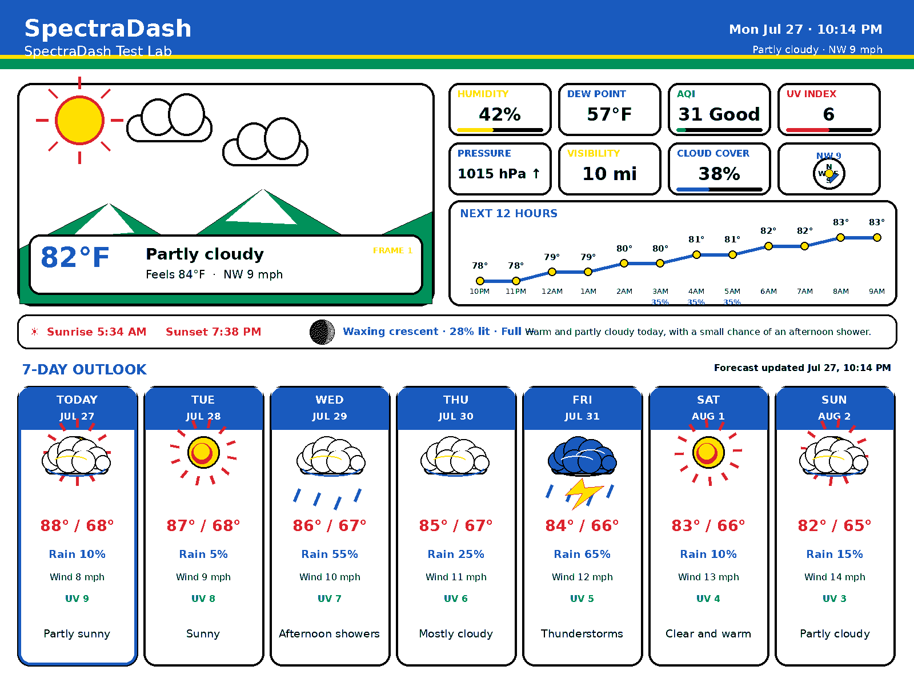

# SpectraDash 8.0

SpectraDash is a self-hosted weather and information dashboard for Raspberry Pi e-paper displays. It includes a dedicated refresh daemon, browser-based settings, responsive display profiles, a screen designer, plugins, diagnostics, Developer Mode, Lite mode for the Pi Zero 2 W, and six-color artwork.

> **Release status:** 8.0.0-rc18.1 is prepared for testing. The Waveshare 13.3-inch Spectra 6 profile is verified on physical hardware. Other profiles are experimental until community members complete the documented hardware test procedure.




### Premium LCD appearance modes

The **Premium LCD-inspired** layout supports three appearances in Weather Studio:

- **Dark** — black instrument-panel background.
- **Light** — white background with dark typography and palette-safe accents.
- **Automatic** — light during daytime and dark after sunset, applied on the next normal refresh.

## Supported display profiles

| Display | Resolution | Status |
|---|---:|---|
| Waveshare 13.3-inch Spectra 6 (E) | 1600×1200 | ✅ Verified |
| Waveshare 7.3-inch Spectra 6 (E) | 800×480 | 🧪 Experimental |
| Waveshare 7.5-inch V2 B/W | 800×480 | 🧪 Experimental |
| Waveshare 5.65-inch seven-color (F) | 600×448 | 🧪 Experimental |
| Waveshare 4.2-inch V2 B/W | 400×300 | 🧪 Experimental |
| Generic browser preview | 1024×600 | Preview only |

See [Display Support](docs/DISPLAY_SUPPORT.md) and [Hardware Testing](docs/HARDWARE_TESTING.md).

## Features

- Separate web and refresh-daemon services for unattended reliability.
- Automatic scheduled refreshes, retries, heartbeat monitoring, and watchdog recovery.
- Display profile registry with native resolution, palette, driver mapping, density, and verification state.
- Resolution-independent 12×12 Screen Designer grid.
- Six-color, monochrome, and seven-color-aware output conversion.
- Full and Lite performance modes, including Pi Zero 2 W auto-detection.
- Plugin manager and documented plugin SDK.
- Developer Mode with logs, tests, profiling, diagnostics, and redacted support bundles.
- Software previews for every included display profile.

## Fresh installation

Use Raspberry Pi OS with network access. On a fresh installation:

```bash
unzip spectradash-8.0.0-rc18.1.zip
cd spectradash-8.0
sudo bash install.sh
```

The installer creates `/opt/spectradash`, installs the Python environment and dependencies, retrieves the official Waveshare e-Paper repository, enables SPI, installs systemd units, and starts the web and daemon services.

Open `http://raspberrypi.local:8080`, select the exact display profile in **Settings**, and test the software preview before enabling physical output.

## Upgrade

The installer backs up and preserves `/var/lib/spectradash/config.json`. Always keep your own backup before testing a release candidate.

```bash
sudo bash install.sh
```

## Verify services

```bash
sudo systemctl status spectradash-web --no-pager
sudo systemctl status spectradash-daemon --no-pager
sudo journalctl -u spectradash-daemon -n 100 --no-pager
```

## Development and tests

```bash
python3 -m venv .venv
. .venv/bin/activate
pip install -r requirements.txt
pip install pytest
pytest -q
python scripts/render_previews.py
```

The test suite validates settings, plugins, Developer Mode, profile metadata, profile-sized rendering, hardware test-pattern dimensions, and the display-profile API.

## Screenshots and previews

Software previews are generated by SpectraDash and are labeled as such; they are not presented as photographs of untested hardware.

- [13.3-inch Spectra 6 preview](screenshots/preview-waveshare-13in3e.png)
- [7.3-inch Spectra 6 preview](screenshots/preview-waveshare-7in3e.png)
- [7.5-inch monochrome preview](screenshots/preview-waveshare-7in5v2-bw.png)
- [5.65-inch seven-color preview](screenshots/preview-waveshare-5in65f.png)
- [4.2-inch monochrome preview](screenshots/preview-waveshare-4in2v2-bw.png)

## Contributing

Hardware owners are especially welcome. Read [CONTRIBUTING.md](CONTRIBUTING.md), use the hardware-test issue template, and attach repeatable evidence before requesting that a display be marked verified.

## License

MIT. Waveshare drivers remain subject to the terms of their upstream repository and are downloaded during installation rather than redistributed as part of SpectraDash.

## Stable baseline policy

Development now continues from this exact release candidate. See [Stable Development Baseline](docs/STABLE_BASELINE.md), [Rollback](docs/ROLLBACK.md), and [Incremental Release Policy](docs/INCREMENTAL_RELEASE_POLICY.md).
