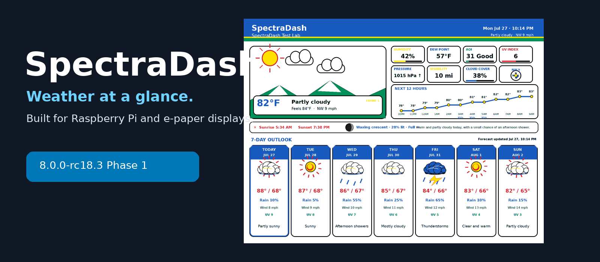
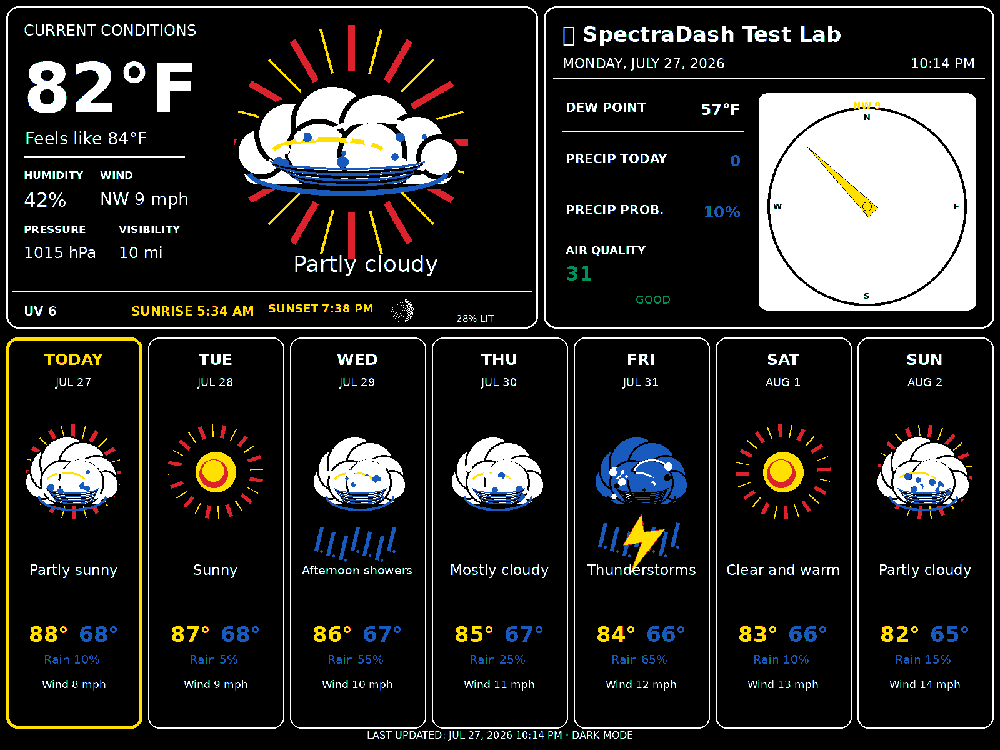
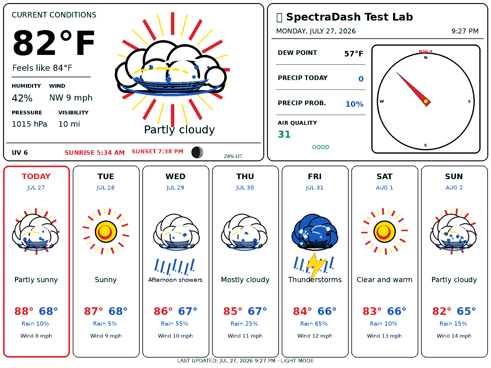
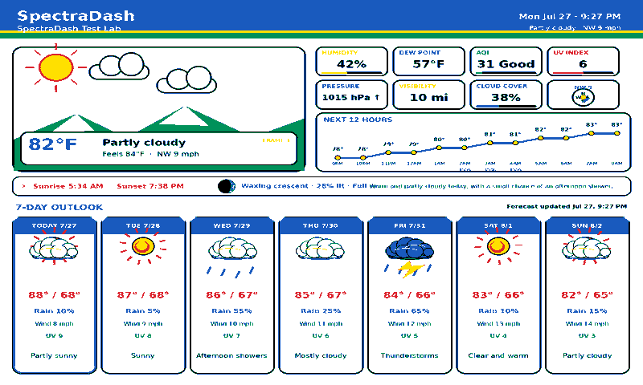
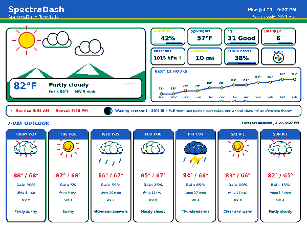
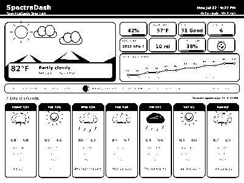

<p align="center">
  
</p>

<h1 align="center">SpectraDash</h1>
<p align="center"><strong>A self-hosted weather and information dashboard for Raspberry Pi and e-paper displays.</strong></p>

<p align="center">
  <a href="https://github.com/cpetzel05/SpectraDash/releases"></a>
  <a href="LICENSE"></a>
  
  
  
</p>

<p align="center">
  <a href="#five-minute-install">Install</a> ·
  <a href="#screenshots">Screenshots</a> ·
  <a href="#supported-hardware">Hardware</a> ·
  <a href="docs/USER_GUIDE.md">User Guide</a> ·
  <a href="docs/TROUBLESHOOTING.md">Troubleshooting</a> ·
  <a href="community/TEST_PILOT_PROGRAM.md">Become a Tester</a>
</p>

> **Current release:** 8.0.0-rc18.3 Phase 1. The application is based on the verified RC18.2 program. A Raspberry Pi 4 installation from GitHub has been successfully completed and the Waveshare 13.3-inch Spectra 6 profile has been tested on physical hardware.

## See it in action

<p align="center">
  <a href="screenshots/preview-waveshare-13in3e.png"></a>
</p>

<p align="center">
  <em>Weather Station layout rendered for the Waveshare 13.3-inch Spectra 6 display.</em>
</p>

| Premium LCD — dark | Premium LCD — light |
|---|---|
| <a href="screenshots/preview-premium-lcd-dark-13in3.png"></a> | <a href="screenshots/preview-premium-lcd-light-13in3.png"></a> |

## What it does

SpectraDash turns a Raspberry Pi into a configurable weather station for e-paper displays. Configuration is handled from a web browser, while a background service downloads weather data, renders the selected layout, and safely refreshes the display.

- Live current conditions and seven-day forecast through Open-Meteo
- Temperature, feels-like temperature, humidity, dew point, wind, precipitation, pressure, sunrise, sunset, Moon phase, AQI, UV, and weather alerts
- Weather Station and Premium LCD layouts
- Light, dark, automatic, and community themes
- Browser-based Setup Wizard, settings, diagnostics, preview, Weather Studio, Developer Mode, and Screen Designer
- Scheduled display refreshes with retry handling, heartbeat monitoring, and watchdog recovery
- Plugin system with bundled examples and a documented SDK
- Full and Lite modes for Raspberry Pi 4 and Raspberry Pi Zero 2 W
- Configuration export, import, reset, and factory reset
- Clean first-run experience with **no preset ZIP code or city**
- Uninstall script with optional configuration and display-driver removal

# Five-minute install

## Method 1: Install directly from GitHub — recommended

Run these commands on Raspberry Pi OS:

```bash
sudo apt update
sudo apt install -y git

git clone https://github.com/cpetzel05/SpectraDash.git
cd SpectraDash
chmod +x install.sh uninstall.sh
sudo ./install.sh
```

When installation finishes, open one of these addresses from a computer or phone on the same network:

```text
http://raspberrypi.local:8080
```

or:

```text
http://<YOUR_PI_IP>:8080
```

To find the Pi's IP address:

```bash
hostname -I
```

### First launch

A new installation contains no saved location. SpectraDash automatically opens the Setup Wizard, where the user selects:

1. City or ZIP code
2. Display profile
3. Temperature and measurement units
4. Layout and theme
5. Refresh schedule

Weather downloads and automatic display refreshes begin after setup is completed.

## Method 2: Install a GitHub release ZIP

Download the latest release ZIP from the repository's **Releases** page, then run:

```bash
unzip SpectraDash-8.0.0-rc18.3.zip
cd SpectraDash-8.0.0-rc18.3
chmod +x install.sh uninstall.sh
sudo ./install.sh
```

> Folder names can differ slightly depending on how GitHub names the downloaded archive. Use `ls` to confirm the extracted directory.

## Updating an existing GitHub installation

```bash
cd ~/SpectraDash
git pull --ff-only
chmod +x install.sh uninstall.sh
sudo ./install.sh
```

The installer preserves the existing configuration and creates a backup before updating.

## Uninstalling

Remove the program and services while keeping saved configuration and cached data:

```bash
sudo bash /opt/spectradash/uninstall.sh
```

Remove the program, configuration, cached data, and downloaded Waveshare driver:

```bash
sudo bash /opt/spectradash/uninstall.sh --purge-data --remove-driver
```

See the full [Uninstall Guide](docs/UNINSTALL.md).

## Supported hardware

### Raspberry Pi

| Raspberry Pi | Status | Notes |
|---|---|---|
| Raspberry Pi 4 | ✅ Verified | Successful clean GitHub installation and operation |
| Raspberry Pi Zero 2 W | ✅ Working | Full graphics tested using Raspberry Pi OS Lite / CLI mode |
| Raspberry Pi 5 | 🧪 Community testing | Reports welcome |
| Other Pi models | 🧪 Community testing | Performance depends on RAM and display driver |

### Displays

| Display profile | Resolution | Status |
|---|---:|---|
| Waveshare 13.3-inch Spectra 6 / e-Paper HAT+ (E) | 1600×1200 | ✅ Verified on physical hardware |
| Generic browser preview | 1024×600 | ✅ Supported |
| Waveshare 7.3-inch Spectra 6 (E) | 800×480 | 🧪 Profile available; hardware report requested |
| Waveshare 7.5-inch V2 black-and-white | 800×480 | 🧪 Profile available; hardware report requested |
| Waveshare 5.65-inch seven-color (F) | 600×448 | 🧪 Profile available; hardware report requested |
| Waveshare 4.2-inch V2 black-and-white | 400×300 | 🧪 Profile available; hardware report requested |

A software preview does not automatically mean a display has been physically verified. See [Supported Displays](community/SUPPORTED_DISPLAYS.md) and [Display Configuration](docs/DISPLAY_CONFIGURATION.md).

## Screenshots

### 13.3-inch Weather Station

<p align="center">
  <a href="screenshots/preview-waveshare-13in3e.png"></a>
</p>

### Premium LCD modes

| Dark | Light |
|---|---|
| <a href="screenshots/preview-premium-lcd-dark-13in3.png"></a> | <a href="screenshots/preview-premium-lcd-light-13in3.png"></a> |

### Additional display previews

| 7.3-inch Spectra | 5.65-inch seven-color | 4.2-inch B/W |
|---|---|---|
| <a href="screenshots/preview-waveshare-7in3e.png"></a> | <a href="screenshots/preview-waveshare-5in65f.png"></a> | <a href="screenshots/preview-waveshare-4in2v2-bw.png"></a> |

These are software-rendered previews. Physical-hardware photographs submitted by testers can be added to the [Community Showcase](community/SHOWCASE.md).

## Managing SpectraDash

Common service commands:

```bash
sudo systemctl status spectradash-web --no-pager
sudo systemctl status spectradash-daemon --no-pager
sudo systemctl restart spectradash-web spectradash-daemon
```

Recent logs:

```bash
sudo journalctl -u spectradash-web -n 100 --no-pager
sudo journalctl -u spectradash-daemon -n 100 --no-pager
```

## Documentation

| Getting started | Displays and hardware | Development and community |
|---|---|---|
| [Installation](docs/INSTALLATION.md) | [Display Configuration](docs/DISPLAY_CONFIGURATION.md) | [Developer Guide](docs/DEVELOPER_GUIDE.md) |
| [First Run](docs/FIRST_RUN.md) | [Display Support](docs/DISPLAY_SUPPORT.md) | [Plugin Guide](docs/PLUGIN_GUIDE.md) |
| [User Guide](docs/USER_GUIDE.md) | [Hardware Testing](docs/HARDWARE_TESTING.md) | [Testing Guide](docs/TESTING_GUIDE.md) |
| [Upgrading](docs/UPGRADING.md) | [Supported Displays](community/SUPPORTED_DISPLAYS.md) | [Contributing](CONTRIBUTING.md) |
| [Uninstall](docs/UNINSTALL.md) | [Tested Hardware](community/TESTED_HARDWARE.md) | [Roadmap](community/ROADMAP.md) |
| [FAQ](docs/FAQ.md) | [Known Issues](community/KNOWN_ISSUES.md) | [Test Pilot Program](community/TEST_PILOT_PROGRAM.md) |
| [Troubleshooting](docs/TROUBLESHOOTING.md) | [Community Showcase](community/SHOWCASE.md) | [Architecture](docs/ARCHITECTURE.md) |

## Join the test pilot

Owners of other Raspberry Pi models or e-paper displays can help expand the compatibility list. A useful report includes:

- Exact display model and product link
- Raspberry Pi model
- Raspberry Pi OS version and architecture
- Installation method
- Display profile selected
- Software-preview result
- Physical test-pattern result
- Refresh duration and visible artifacts
- Sanitized logs and clear photographs

Open a [Display Compatibility Report](https://github.com/cpetzel05/SpectraDash/issues/new?template=display_compatibility.yml) and follow the [Test Pilot Program](community/TEST_PILOT_PROGRAM.md).

## Roadmap

- **RC18.3:** documentation, GitHub presentation, and test-pilot readiness
- **RC18.4:** community display validation and profile corrections
- **RC18.5:** carefully selected tester-requested improvements
- **RC19:** feature freeze and regression testing
- **Version 1.0:** stable public release

See the full [Roadmap](community/ROADMAP.md).

## Contributing and support

Read [CONTRIBUTING.md](CONTRIBUTING.md) before opening a pull request. Use GitHub Issues for reproducible bugs, display reports, and feature requests. GitHub Discussions can be used for installation questions, ideas, and project showcases after Discussions is enabled for the repository.

## License

SpectraDash is released under the [MIT License](LICENSE). Waveshare drivers remain subject to their upstream license and are downloaded during installation rather than redistributed.
